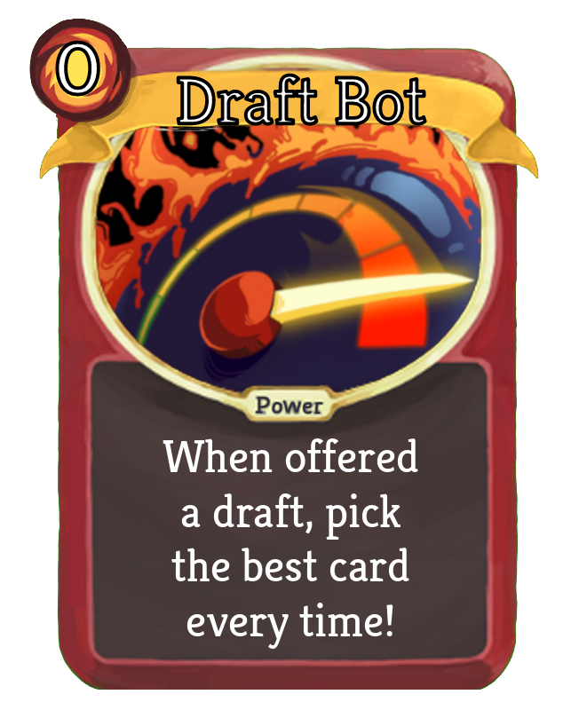

# Reinnforcement Learning Drafting Bot
A package for using Communication Mod with Slay the Spire, plus a simple AI with a reinforcement learning drafting AI module.

### Tech Used:
* Python
* numpy
* pandas
* PySimpleGUI (In GUI and Presentation branch)
* Reinforcement Learning
* A/B Testing

## Setup:
1. Install [Communication Mod](https://github.com/ForgottenArbiter/CommunicationMod) and prereqs
    * ModTheSpire - Steam Workshop version
    * BaseMod - Steam Workshop version
1. Run modded Slay The Spire with communication mod enabled
1. Update Communicaton Mod Config that is created afterwards
    * `~/.config/ModTheSpire/CommunicationMod/config.properties` for linux
1. set `command=python3 path_to_script/main.py` 
1. Set specific run configs
    * `boto = False` :Set to true and update AWS resources to point to personal buckets for backing up training data to s3 bucket
    * `solo = False` : Run single seed from seed_list, currently 53HJXL2N4CEYI
    * `control_group = False` : Set to True for using built-in drafter (in priorities.py)
    * `epochs = 2` : How many traversals of the seed_list. 1 means each seed is played once.
    
    