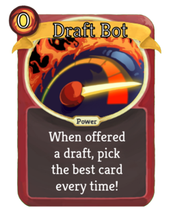

# Reinnforcement Learning Drafting Bot
A package for using Communication Mod with Slay the Spire, plus a simple AI with a reinforcement learning drafting AI module.

|  | | 
| ---- | --- | 
|  | <h2>Tech Used</h2><h3> <ul><li>Python</li><li>numpy</li><li>pandas</li><li>PySimpleGUI (In GUI and Presentation branch)</li><li>Reinforcement Learning</li><li>A/B Testing</li></ul></h3>|

## Setup:
1. Install [Communication Mod](https://github.com/ForgottenArbiter/CommunicationMod) and prereqs
    * ModTheSpire - Steam Workshop version
    * BaseMod - Steam Workshop version
1. Run modded Slay The Spire with communication mod enabled
1. Update Communicaton Mod Config that is created afterwards
    * `~/.config/ModTheSpire/CommunicationMod/config.properties` for linux
1. set `command=python3 path_to_script/main.py` 
1. Set specific run configs
    * `boto = False` :Set to true and update AWS resources to point to personal buckets for backing up training data to s3 bucket
    * `solo = False` : Run single seed from seed_list, currently 53HJXL2N4CEYI
    * `control_group = False` : Set to True for using built-in drafter (in priorities.py)
    * `epochs = 2` : How many traversals of the seed_list. 1 means each seed is played once.
    
1. Launch Slay The Spire with mods and go to communication mods setting and click "Start External Process"
1. Sit back and watch your Ironclad bot try and slay the spire!
    * The mod SuperFastMode helps a -lot- for speeding up training.
     
## Results and Theory:

### Overview
The core of the idea for this drafter is that cards have synergies with other cards. These can be positive or negative and represented as a symmetric matrix where rows and columns are cards.

Example:
* note that these are only 4 cards and are examples, true weights are learned over time!

Given that we know what cards are in our deck, we can multiply our deck against this matrix and generate scores for how well any card will synergize with our deck.

Our bot tries a bunch of different synergy matrices and the ones that go higher up in the spire are kept. So far the learning has improved on the built-in drafter performance and has a lot of room for future growth!

### The Learning Process

This drafting bot uses reinforcement learning, looking to maximize the number of floors climbed.

#### The Learning Cycle:
On first start: initialize synergy matrix with all 1s
* The bot essentially is choosing cards randomly

1. Play through a set of seeds, recording information about the run (floor reached, score, card choices offered, cards chosen)
1. Adjust synergy weights of all cards offered during run
1. Replay the same seeds, recording down information
    * If the average performance is better (bot got to higher floors), keep weights
    * Else discard weights
1. Adjust weights again

This loop continues for as long as desired. The epoch hyper-parameter is how many times to update these weights and run the gauntlet of seeds.

### Future Improvements:
* Include simulated annealing to the learning method
    * This will help allow for finding a more global maximum for card synergies
* Expand matrix to include upgraded and common cards
    * currently all cards are treated as the same regardless of upgrade
        * Searing Blow decks would like to have a word
* Package this cleanly for steam workshop mod

[Presentation Link - Has more diagrams and info](https://docs.google.com/presentation/d/108OTWbYuwOMsNpGVkpgZ1RFfhfvuT43Msdrc4EjmLsU/edit?usp=sharing)
